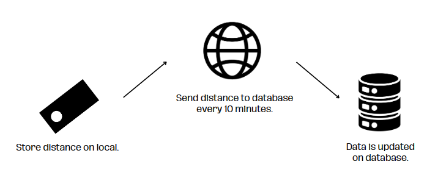
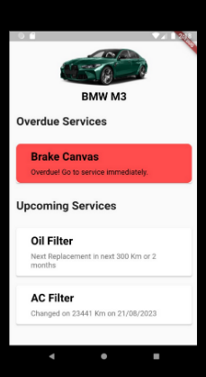

# Introduction
Jaga is an innovative vehicle maintenance reminder application. By leveraging GPS tracking technology, Jaga is capable of collecting kilometer data from user vehicles. The application not only gathers information but also has the ability to determine the appropriate time for vehicle servicing. This decision is based on both the distance traveled and the time elapsed since the last maintenance. Thus, Jaga provides an intelligent solution to ensure that vehicles are always in optimal condition and safe on the road.

# Project management
JAGA, a mobile application accessible on both Android and iOS devices, aims to utilize GPS tracking to collect essential data on kilometers driven and time elapsed since the last vehicle service. This information will be instrumental in predicting when a vehicle is due for servicing, triggering timely reminders for the owner. Additionally, the application will provide users with the ability to access their service history and book appointments directly through the app.

The JAGA project will adhere to an agile development methodology, incorporating both Scrum and Kanban frameworks. Scrum, an iterative and incremental approach, will facilitate short development cycles with regular feedback from stakeholders. Concurrently, Kanban, a flexible workflow management method, will help visualize the team's work and identify potential bottlenecks. The choice of these methodologies reflects the commitment to delivering a product that meets both quality and market demands.

# Design
Jaga is designed to be a user-friendly and accessible application. The user interface is simple and intuitive, and the application can be used with a wide range of vehicles, regardless of their make or model. Jaga utilizes GPS tracking technology to collect kilometers data from the vehicles and uses intelligent algorithms to notify vehicle owners when their vehicles require servicing.

## Key function and modules
<!-- UL -->
* GPS tracking   Jaga tracks a vehicle's location in real-time, accumulating data on
kilometers driven
* Notification system   It sends timely reminders to vehicle owners via applications,
including push notifications, SMS messages, and emails.
* User interface   Jaga's user-friendly interface allows users to set maintenance
preferences, view service history, and access other information about their vehicles.
* Data analytics   The application analyzes vehicle data to predict service needs
accurately.
* Maintenance history tracking   Users will be able to view a complete history of their
vehicle's maintenance, including the dates and types of services performed.

## Technical architecture
    
  
 Jaga is built using the following technologies:
<!--UL-->
* Programming languages: JavaScript and Java
* Backend Framework: NestJs
* Frontend Framework: Android Studio
* Database: PostgreSQL
* Hosting: Vercel
*Hardware: GPS tracking devices using ESP32 and Neo 6M module

## UML Diagram
### Class diagram

### Use Case Diagram

### Sequence Diagram

### Activity Diagram

# Implementation
    
The GPS module retrieves essential data for distance calculations and transmits it to the server at regular intervals, approximately every 10 minutes. This data is then utilized to update the server's database, ensuring real-time accuracy. Upon reaching a predefined kilometer threshold requiring routine maintenance, the server initiates reminders through the Jaga application to alert users. The Jaga application is versatile, capable of managing multiple vehicles, and is not limited by specific vehicle brands.

To access the Jaga application, users need to create an account, a process that involves entering a username and password. This account ensures a personalized experience for users, allowing them to track and manage the maintenance needs of their vehicles seamlessly. The account credentials also serve as a secure gateway, safeguarding user data and maintaining the privacy of their vehicle-related information.

The Jaga application stands out for its user-friendly interface, providing an intuitive and efficient platform for users to set preferences and view comprehensive maintenance histories. Beyond its practicality, the application emphasizes inclusivity by accommodating various vehicle makes and models. This flexibility ensures that Jaga meets the diverse needs of users, making it a versatile and accessible solution for vehicle maintenance reminders.

# Test results and performance evaluation
## Hardware
### Wifi Connection

### Reconnect to Wifi

### GPS Module 

### Send data to database

   

## Application
### Sign Up

### Login

### Bluetooth
  

### Main page

# Conclusion and future work
Jaga presents an innovative vehicle maintenance application utilizing GPS tracking for intelligent service reminders. By periodically sending distance data to the server, Jaga ensures timely updates in the database, triggering maintenance alerts to users through its versatile application. With a focus on real-time tracking, a robust notification system, and a user-friendly interface accommodating multiple vehicles, Jaga stands as a comprehensive and user-centric solution, promising to enhance vehicle maintenance practices through a combination of advanced technology and practicality.

In addressing potential enhancements, a key focus lies in the improvement of the GPS module utilized in the current system. The existing GPS module has demonstrated limitations in providing precise coordinate calculations. Future work could entail exploring more advanced GPS technologies or incorporating additional sensors to enhance accuracy. By investing in the refinement of the GPS module, the Jaga application can elevate its capability to offer more accurate and reliable location data, contributing to an even more robust and effective vehicle maintenance reminder system.

